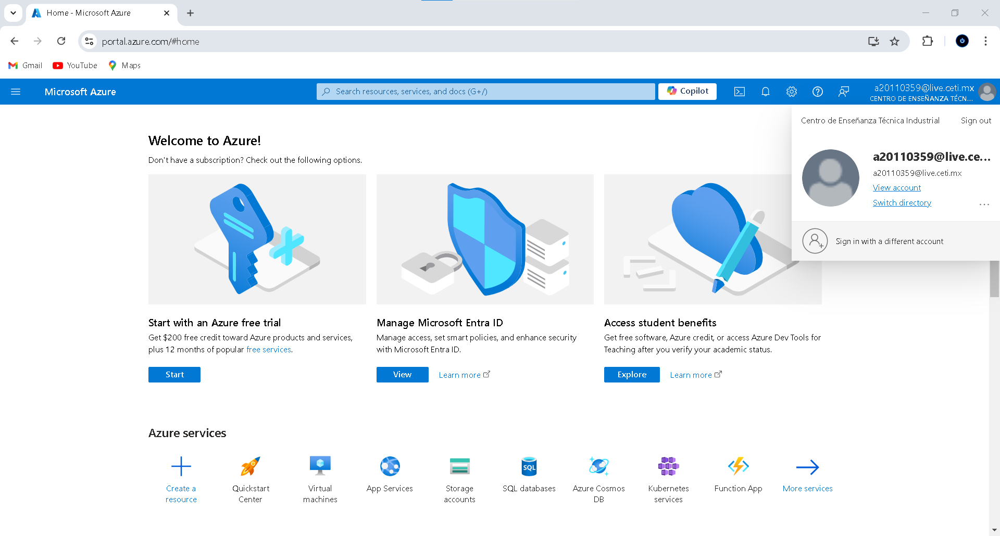
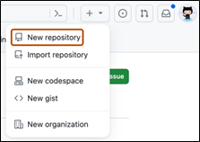

## Simple Personal Website for Azure Static Web App

This project is a simple personal website created to develop and test the Azure Static Web App using GitHub Actions or to utilize Create Azure Web App with Azure App Services. It is part of the task assigned for the EPAM [Fundamentals] Cloud & DevOps Assessment Mexico, as part of the Cloud Assessment program.

### Purpose

The goal of this project is to demonstrate the ability to:

- Deploy a personal website using Azure Static Web Apps.
- Utilize GitHub Actions for Continuous Integration/Continuous Deployment (CI/CD).
- Explore the usage of Azure App Services for web hosting and deployment.

### Project Contents
- A basic HTML file that includes:
  - A black background.
  - A title with the developer's name.
  - A link to the developer's LinkedIn profile.
  - A link to the developer's GitHub profile.
  - A centered image.
- A GitHub Actions workflow to automate deployment to Azure.
- Step-by-step instructions and screenshots (found in the README.md file) that detail the setup and deployment process. Additionally, there is a [link to the Azure Fundamentals Task Instructions](documents/Azure_Fundamentals_Task_Gustavo_Adolfo_Carrillo_Camacho.pdf) to the same instructions and screenshots in PDF format located in the section of the README.md named 'Additional Resources.'

### Deployment
The project is deployed on Azure Static Web Apps, with the DNS record provided by Microsoft under the .azurewebsites.net domain.

### Additional Resources
For detailed instructions on how to deploy the simple web app on the Cloud Azure, please refer to the PDF document located in the documents folder: [Azure Fundamentals Task Instructions](documents/Azure_Fundamentals_Task_Gustavo_Adolfo_Carrillo_Camacho.pdf)

### Setup and Deployment Process

1.	#### Create Azure Web App with Azure App Services. 
Go to Azure portal. Azure Static Web Apps is very simple and easy to work with. There are 3 ways to create the Azure Static Web Apps, i.e., VS Code, Azure portal, and Azure CLI. 
Select an option from the 3 given, in this example was selected Access student benefits.

  

  <em>Fig 1: Create Azure Portal Account</em>

2.	#### Create GitHub repo with simple personal website. 
**Create GitHub repo**

GitHub repositories store a variety of projects. In this guide, you'll create a repository and commit your first change.

  - In the upper-right corner of any page, select, then click New repository.

  

  <em>Fig 1: Create GitHub repository</em>

