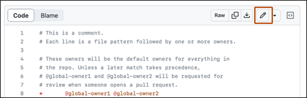

## Simple Personal Website for Azure Static Web App

This project is a simple personal website created to develop and test the Azure Static Web App using GitHub Actions or to utilize Create Azure Web App with Azure App Services. It is part of the task assigned for the EPAM [Fundamentals] Cloud & DevOps Assessment Mexico, as part of the Cloud Assessment program.

### Purpose

The goal of this project is to demonstrate the ability to:

- Deploy a personal website using Azure Static Web Apps.
- Utilize GitHub Actions for Continuous Integration/Continuous Deployment (CI/CD).
- Explore the usage of Azure App Services for web hosting and deployment.

### Project Contents
- A basic HTML file that includes:
  - A black background.
  - A title with the developer's name.
  - A link to the developer's LinkedIn profile.
  - A link to the developer's GitHub profile.
  - A centered image.
- A GitHub Actions workflow to automate deployment to Azure.
- Step-by-step instructions and screenshots (found in the README.md file) that detail the setup and deployment process. Additionally, there is a [link to the Azure Fundamentals Task Instructions](documents/Azure_Fundamentals_Task_Gustavo_Adolfo_Carrillo_Camacho.pdf) to the same instructions and screenshots in PDF format located in the section of the README.md named 'Additional Resources.'

### Deployment
The project is deployed on Azure Static Web Apps, with the DNS record provided by Microsoft under the .azurewebsites.net domain.

### Additional Resources
For detailed instructions on how to deploy the simple web app on the Cloud Azure, please refer to the PDF document located in the documents folder: [Azure Fundamentals Task Instructions](documents/Azure_Fundamentals_Task_Gustavo_Adolfo_Carrillo_Camacho.pdf)

### Setup and Deployment Process

1.	#### Create Azure Web App with Azure App Services. 
Go to Azure portal. Azure Static Web Apps is very simple and easy to work with. There are 3 ways to create the Azure Static Web Apps, i.e., VS Code, Azure portal, and Azure CLI. 
Select an option from the 3 given, in this example was selected Access student benefits.

  

  <em>Fig 1: Create Azure Portal Account</em>

2.	#### Create GitHub repo with simple personal website. 
**Create GitHub repo**

GitHub repositories store a variety of projects. In this guide, you'll create a repository and commit your first change.

  - In the upper-right corner of any page, select, then click New repository.

  

  <em>Fig 1: Create GitHub repository</em>

  - Type a short, memorable name for your repository. For example, "hello-world".

  

  <em>Fig 2: Create GitHub repository</em>

  - Optionally, add a description of your repository. For example, "My first repository on GitHub."
  - Choose a repository visibility. 
  - Select Initialize this repository with a README.
  - Click Create repository.

Congratulations! You've successfully created your first repository and initialized it with a README file.

**Commit your first change**

A commit is like a snapshot of all the files in your project at a particular point in time.
When you created your new repository, you initialized it with a README file. README files are a great place to describe your project in more detail or add some documentation such as how to install or use your project. The contents of your README file are automatically shown on the front page of your repository.

Let's commit a change to the README file.

  - In your repository's list of files, select README.md.

  

  <em>Fig 3: Commit your first change</em>

  - In the upper right corner of the file view, click to open the file editor.

  

  <em>Fig 4: Commit your first change</em>

  - In the text box, type some information about yourself.
  - Above the new content, click `Preview`.

  

  <em>Fig 5: Commit your first change</em>

  - Review the changes you made to the file. If you select Show diff, you will see the new content in green.

  

  <em>Fig 6: Commit your first change</em>

  - Click Commit changes...
  - In the "Commit message" field, type a short, meaningful commit message that describes the change you made to the file. You can attribute the commit to more than one author in the commit message.  
  - Below the commit message fields, decide whether to add your commit to the current branch or to a new branch. If your current branch is the default branch, you should choose to create a new branch for your commit and then create a pull request. 

  

  

  <em>Fig 7: Commit your first change</em>

  - Click Commit changes or Propose changes.

**Next steps**

You have now created a repository, including a README file, and created your first commit on GitHub.
  - You can now clone a GitHub repository to create a local copy on your computer. From your local repository you can commit and create a pull request to update the changes in the upstream repository. 
  - You can find interesting projects and repositories on GitHub and make changes to them by creating a fork of the repository. Forking a repository will allow you to make changes to another repository without affecting the original.
  - Each repository on GitHub is owned by a person or an organization. You can interact with the people, repositories, and organizations by connecting and following them on GitHub.
  - GitHub has a great support community where you can ask for help and talk to people from around the world. Join the conversation on GitHub Community.

>Create the files to generate the simple web site inside your cloned GitHub repository.
